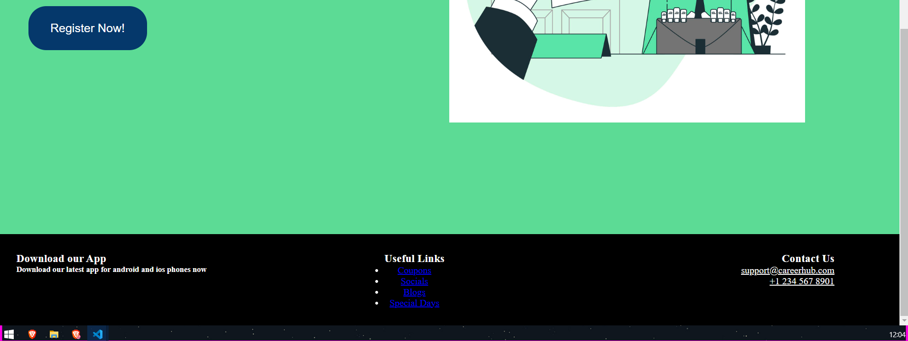
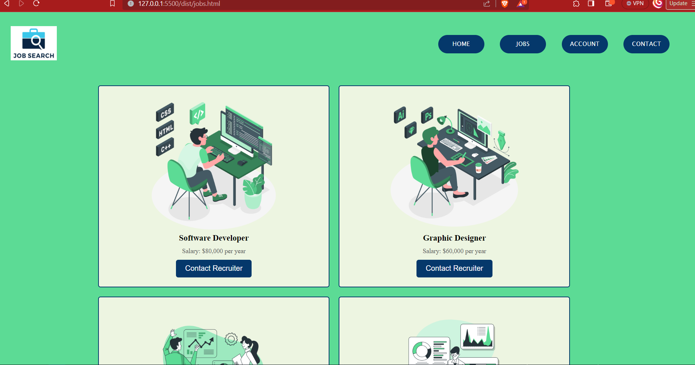
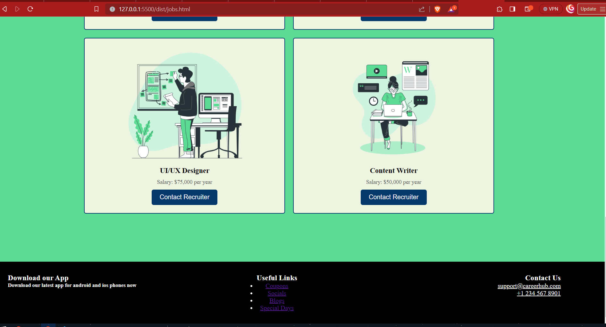
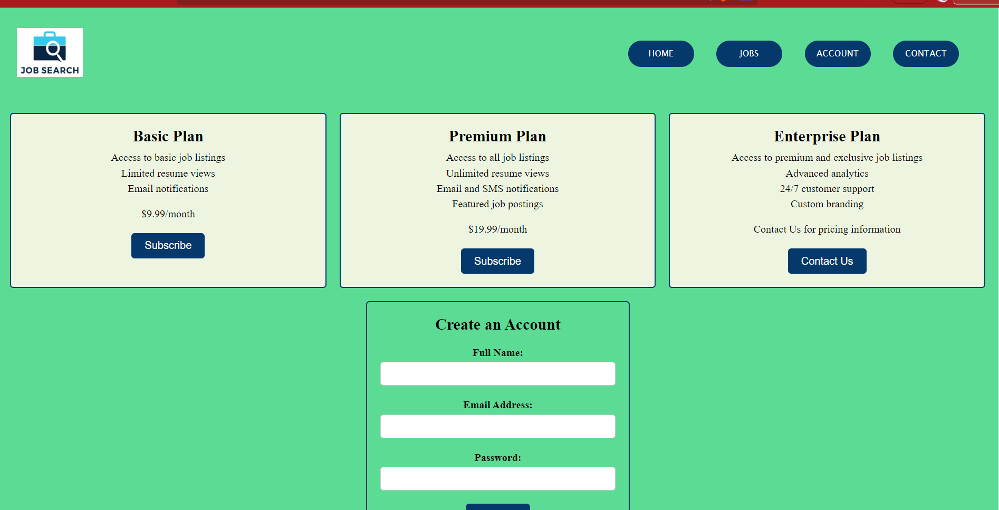
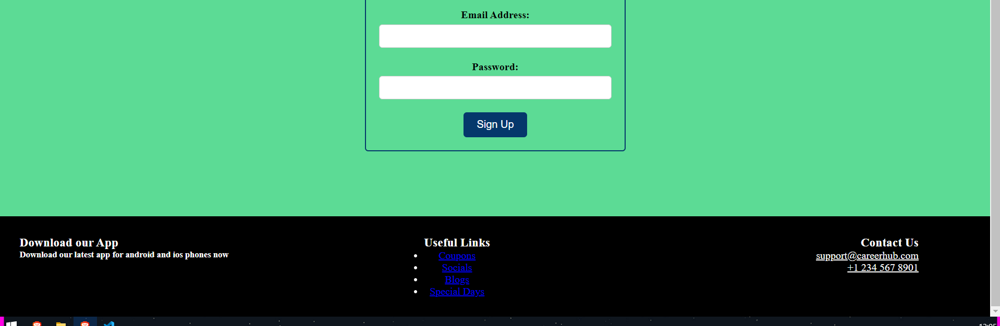

## Ideation:

The idea behind the website is to make a Job Hunting Site.

#### SASS FEATURES USED:

Have used the instructed features:
Variables to define colors and such.
Custom Properties were used so the variables can be plugged into style elements.
Nesting in all the scss files was used so can easily work on child element.
Interpolation was used to define fonts for the site.
Placeholder Selectors were used to make the form of the site.
Mixins were used to define the buttons.
Functions were used to give the buttons a hover effect.

Flexbox was used in header and hero section of the page.
#### Continuation of my Landing Page:

Here, I used button tag(Register Now) to redirect it to my second page.

#### Find JOBS Page:

Here grid layouts are used to display jobs.

#### Account Page:

Here another grid is used to display pricing plans.
Then the form is seen which was created using placeholder selectors.