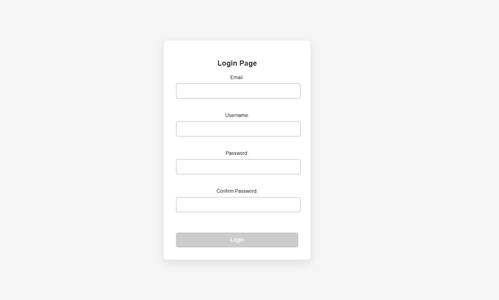
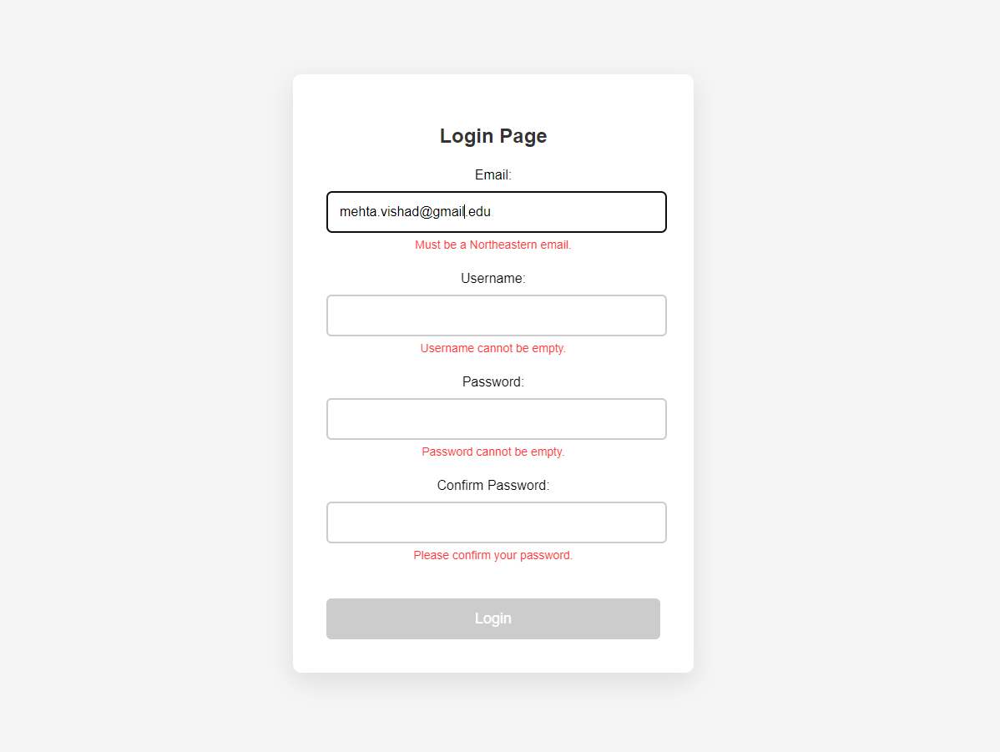
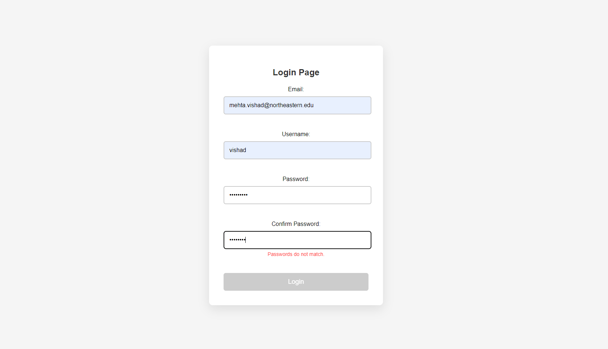
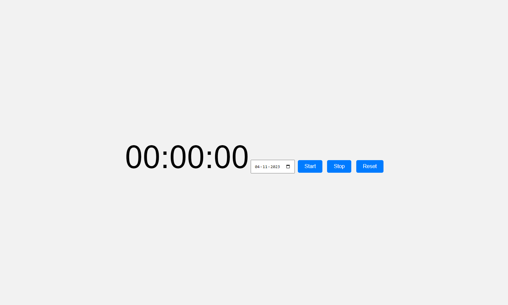
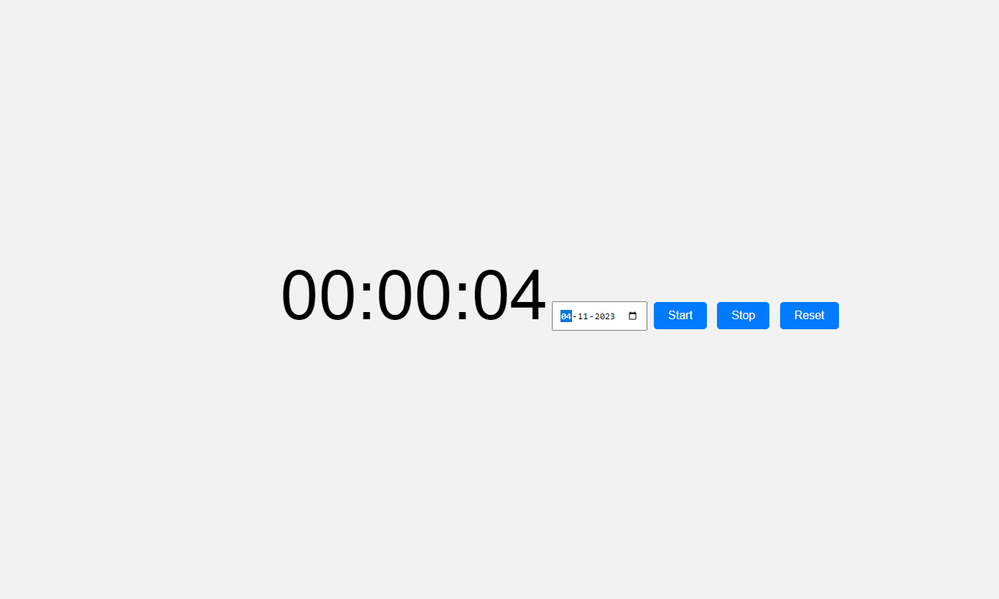

# Simple Web Applications: Calculator & Stopwatch

This repository contains two separate web applications. The first is a simple calculator with a login page that validates user input. The second is a stopwatch that uses async/await, promises, setInterval, and clearInterval.

## Login & Calculator Page

### Features

- *Login Page*:
  - Email validation for northeastern email IDs.
  - Username validation to ensure no special characters.
  - Password and Confirm Password fields with length and match validation.
  - Error messages are displayed below the input fields in red without using pop-ups.
  - The login button is initially disabled and enabled upon valid input.

- *Calculator Page*:
  - Two input fields for numbers with validation against non-numeric input and null values.
  - Four buttons for arithmetic operations: Add, Subtract, Multiply, Divide.
  - The result is displayed in a non-editable field.
  - All operations are performed using a single arrow function.

  
  
  
  

### Technologies Used

- HTML5
- CSS3
- jQuery

## Stopwatch

### Features

- *Display Time*: The label shows the time in "HH:MM:SS" format and starts at 00:00:00.
- *Date Picker*: Displays the current date and allows selection of both past and future dates without being editable.
- *Control Buttons*: 
  - Start: Begins the time counting.
  - Stop: Pauses the stopwatch.
  - Reset: Resets the time to 00:00:00 and stops the stopwatch.

### Technologies Used

- HTML5
- CSS3
- JavaScript with Async/Await, Promises, setInterval, and clearInterval.

