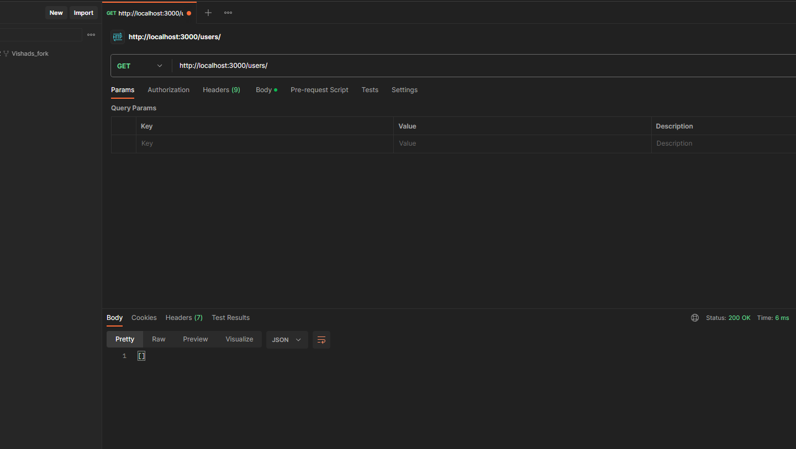
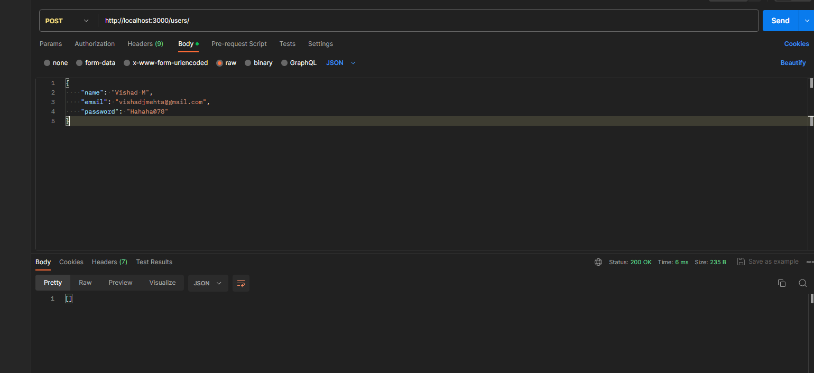
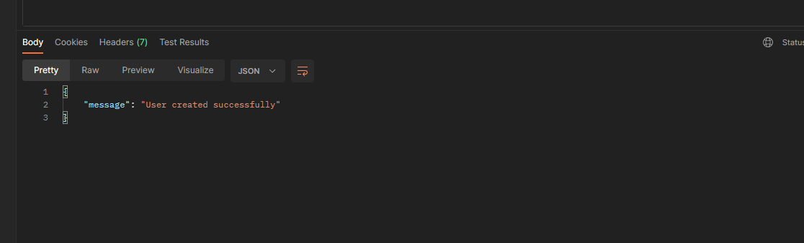
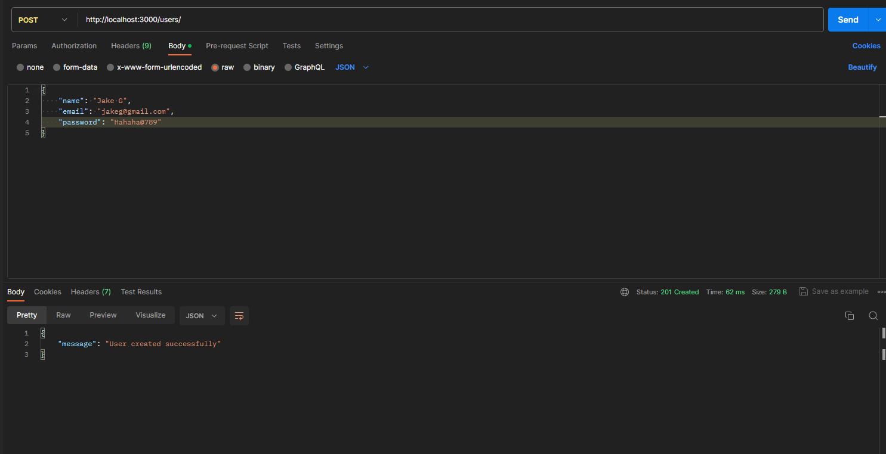
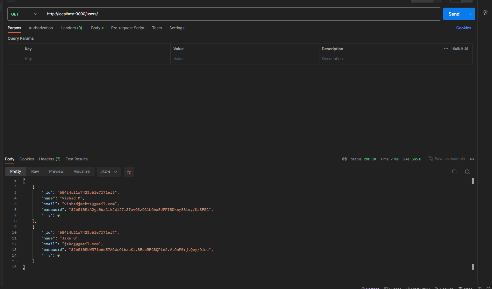
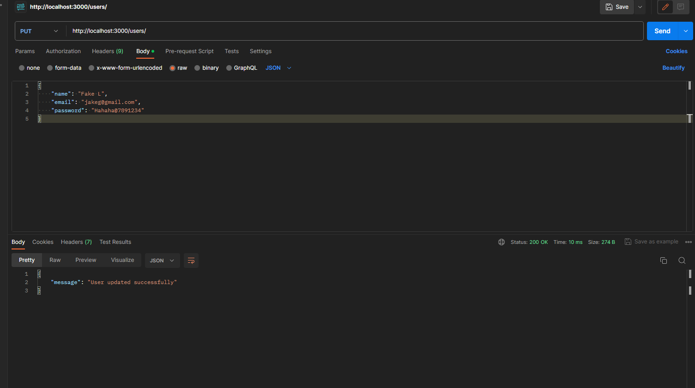
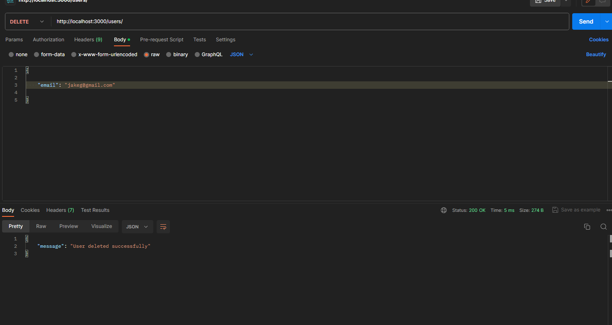
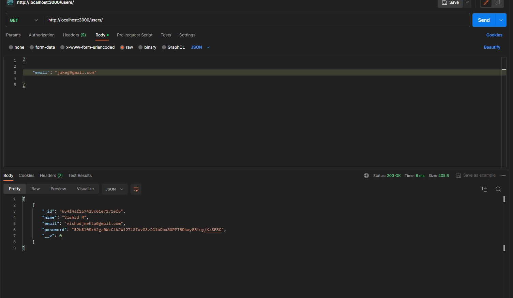

# POST, PUT, DELETE and GET requests shown using Postman

initially the database is empty so: 

on adding users using POST after passing the full name, email and password validation checks:

  
  

Now modifying using PUT:

 

Now using DELETE:

Using GET to show again the remaining user: 

