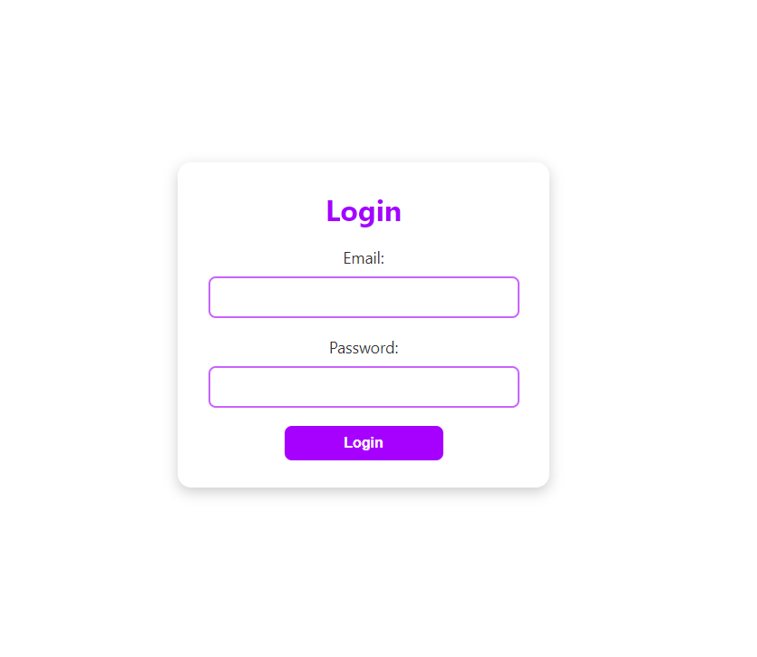
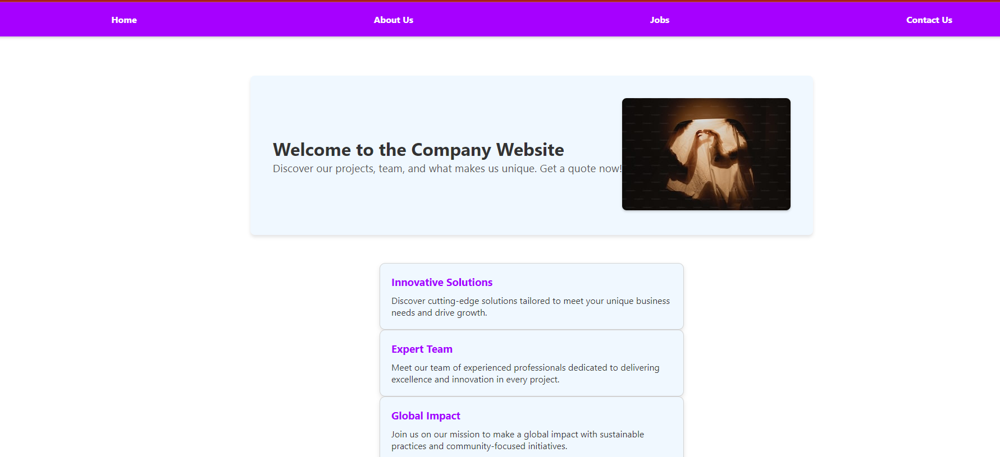
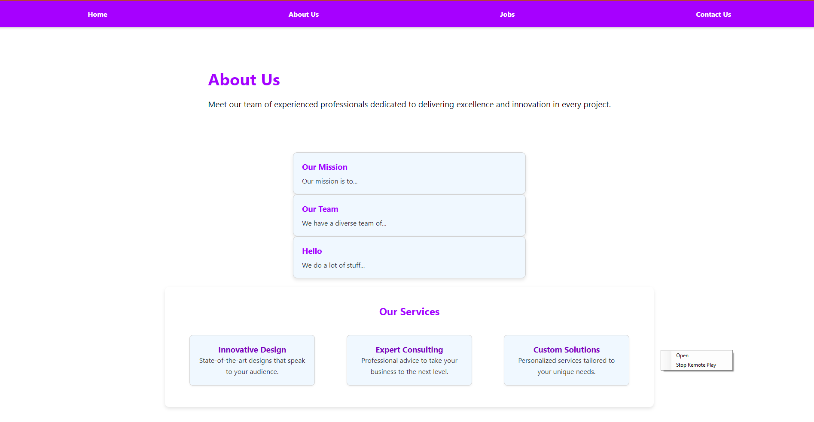
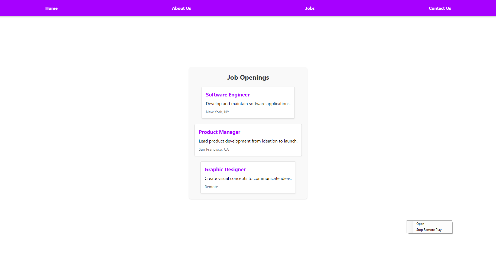
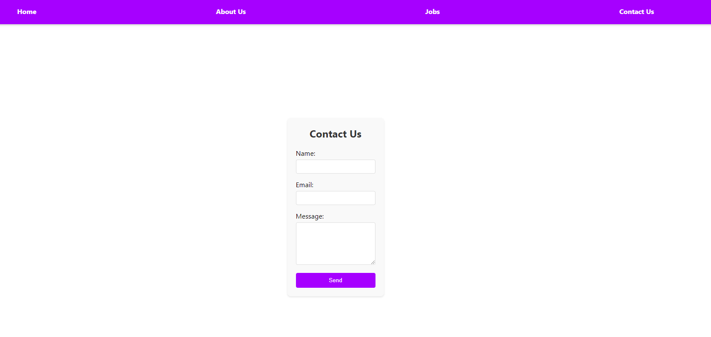

# Login Page, plus 4 Pages with Create React App

This project was made with [Create React App](https://github.com/facebook/create-react-app).

## Available Scripts

In the project directory, you can run:

### `npm start`

Runs the app in the development mode.\
Open [http://localhost:3000](http://localhost:3000) to view it in your browser.
Starts the React servers.

### `npm startBackEnd`

Starts the Backend using mongo

### LOGIN PAGE

Here the user will login which will be verified with backend.

### HOME

This is the home page.

### ABOUT US

This is the about us page. Here a map is used for the card component to make it dynamic

### JOBS

This is the jobs page.

### CONTACT US

This is the contact us page.